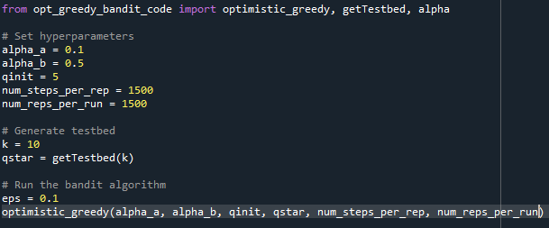
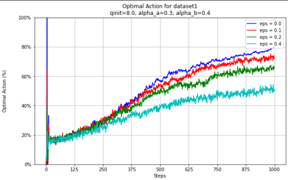
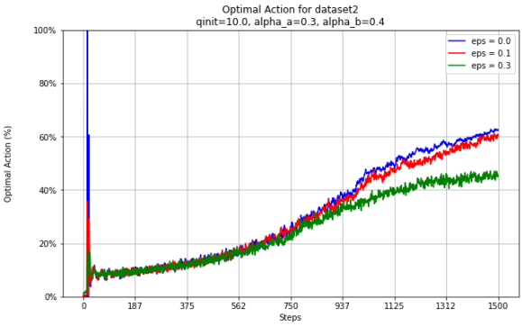
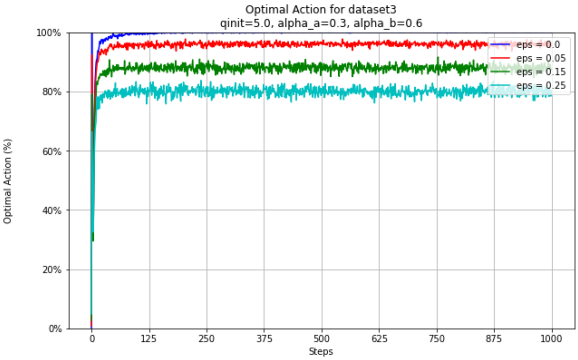
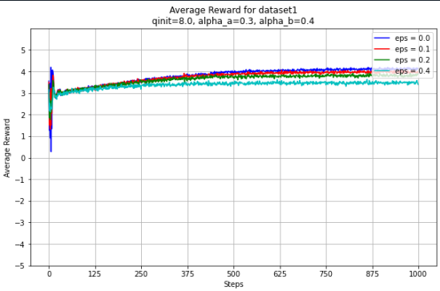
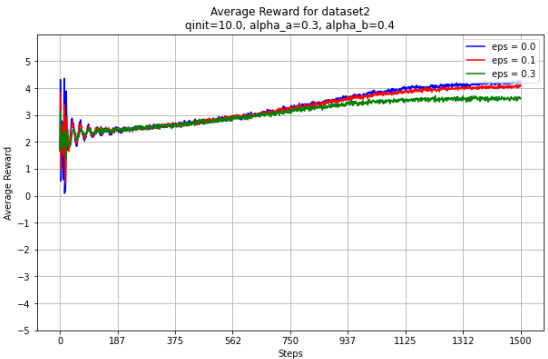
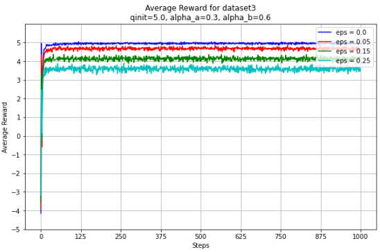

OPER 651 Individual Algorithm Project
# Bandit Algorithm

## Algorithm Purpose
The Optimistic Greedy Bandit algorithm is designed to solve the multi-armed bandit problem, where the goal is to maximize the cumulative reward by selecting actions (bandit arms) based on estimated rewards. The algorithm optimistically initializes the Q-values to encourage exploration and uses an epsilon-greedy strategy to balance exploration and exploitation. Simple Bandit initializes Q values to 0 so other This type of "trick" works well for stationary problems such as pulling slot machines with a known distribution; however, the algorithm is very ineffective when it comes to non-stationary environments because its drive for exploration is tempoarary. 

## Hyperparameters
- `alpha_a`: Controls the step size parameter's numerator.
- `alpha_b`: Controls the step size parameter's denominator scaling.
  The alpha parameters are combined in an equation to make an alpha, this is really helpful when using a latin hypercube sampling to hypertune.
- `qinit`: The initial optimistic value for the Q-values. Determines how explorative we want to be, the higher the more explorative.
- `eps`: The probability of exploring a random action instead of exploiting the best-known action. They are predetermined in the code for the most likely choices.

## Background
The k-armed bandit problem is a classic reinforcement learning problem where an agent must choose between k different actions (or arms) to maximize its reward. Each arm provides a stochastic reward based on an unknown probability distribution. The challenge is to balance exploration (trying new arms) with exploitation (choosing the best-known arm). Essentially, there is an unknown distribution for each arm and the bandit attempts to get familiar enough with the arms to eventually choose the optimal arm to get the most rewards. This directly relates to our projects of finding the best strategy for slot machines.

## History
The multi-armed bandit problem started to be investigated in the early 1900s. It is named after slot machines, also known as one-armed bandits, in casinos. This was the inspiration for our project. The problem involves making a sequence of decisions to choose between multiple options (bandit arms) with unknown reward distributions. The goal is to maximize the total reward over time.

The optimistic initial values approach encourages exploration by initially overestimating the value of all actions. This strategy helps the algorithm to gather more information about the different options, potentially leading to better long-term rewards. This is an add on of the simple bandit. Will get a better solution in the long run, more exploration in the beginning.

In recent years, companies like Amazon have applied multi-armed bandit algorithms to various aspects of their business. For example, Amazon uses these algorithms to optimize product recommendations, dynamically adjust prices, and improve user experiences by personalizing content. By leveraging the exploration-exploitation trade-off, Amazon can continuously learn and adapt to customer preferences, ultimately enhancing their overall satisfaction and increasing sales.

## Variations
- **Simple Bandit:** A simpler version without optimistic initial values.
- **UCB (Upper Confidence Bound):** Uses confidence intervals to balance exploration and exploitation.

## Pseudo Code
```pseudo
Initialize Q-values to qinit for all actions
For each time step t:
    With probability 1 - eps, choose action with highest Q-value
    With probability eps, choose a random action
    Take the action, observe reward r
    Update the Q-value for the action using the reward
```

The psuedo code is essentially the same as the simple epsilon greedy bandit except for the key difference in qinitial for all actions. This qinitial value determines how long the algorithm will be uber greedy in the beginning.

## Example Code


In this instance, you can change the size of the testbed, alpha value, qinitial, qstar, number of steps per run and number of reps per run when you input the optimistic_greedy function from opt_greedy_bandit_code. A key thing to note is that there are many different parameters so it is important to have a plan of which parameters we want to tune. Most of the time we will likely want to tune q-initial because that is the knob that allows to be explore more or less. The number of steps per run and number of reps per run highly impact the accuracy/smoothness of the experiment. But it will also add to the computational complexity. A good rule of thumb is to tune with smaller numbers then for final solutions add more steps and reps for a more accurate result. 

## Visualization or Animation
Below, we will look into performance of the optimal actions for 3 different datasets.One thing to keep in mind is that since they are three datasets, the comparison is not exactly apples to apples but there are some trends we can analyze.


This is the optimality of dataset 1. We completed 1000 steps and 1000 reps per test. We notice throughout the whole figure that there is a constant rise in all of the optimal decisions for each epsilon value. This is likely because 





## Benchmark Results




## Lessons Learned
I learned a lot about what parameters I would want to make avaliable given that we are exporting a module for people to use. I would have been less bogged down in the weeds with alpha values and I would focused on trying to allow the user to make bigger changes such as episilon values, number of steps, number of runs, more specificity in creating the dataset, etc. Since there are so many tuneable parameters, I likely would have picked different focus groups. For example, make one that focuses on computation complexity, aplha/qinits/episilons, etc. Another thing I would likely add to the framework is the ability to hypertune more effectively. It is hard to plug and play our parameters. Instead, I would introduce a latin hypercube sampling algorithm to determine the best parameters for a given problem.

## Unit-Testing Strategy
- test_getTestbed: Ensures the correct number of bandit arms are generated.
- test_simpleBandit: Verifies the function runs correctly and returns arrays of the expected length.
- test_alpha: Checks the correctness of the step size calculation.
- test_getAction: Validates the action selection process using epsilon-greedy strategy.
- test_getReward: Ensures the reward function returns a float value.
- test_updateQconstep: Verifies the Q-value update process using a constant step size.

Essentially, make sure all of our key functions work as they should.

## Code-Coverage Measurement

I installed the code-coverage so every result should provide unit test results.

coverage run -m unittest discover tests

coverage report

coverage html
